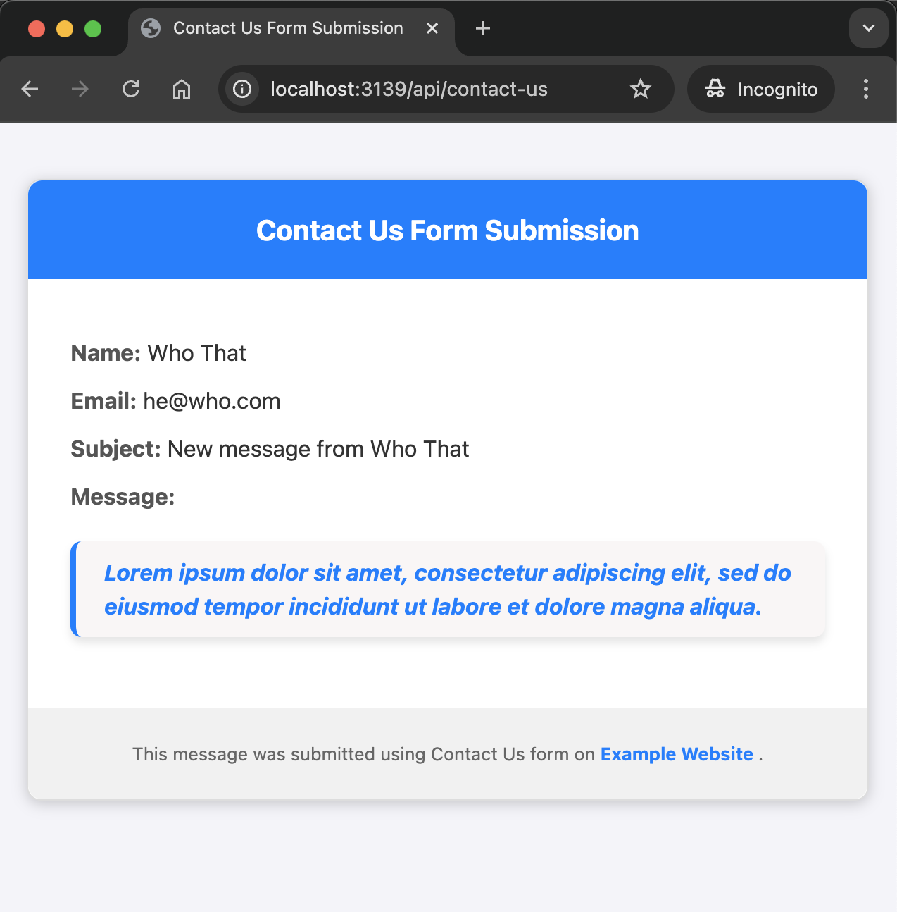

# email-server

Express server for sending emails using [Nodemailer](https://nodemailer.com).

Includes validation for the contact-us form submitted in the front-end. A phone input field is assumed to be hidden in the form & validation includes detecting (as spam) the presence of phone number in the request.

## Environemental Variables

Setup OAuth2 credentials in Google Developer Console for your project. Add the necessary environmental variables to the `.env` file.

A sample - `.env.sample` - is included in the repo.

## Getting Started

Clone the repo & run the following commands to start the app server -

```bash
git clone git@github.com:kukiron/email-server.git
cd email-server
npm i && npm run dev
```

This will start the server on `localhost:3139`

## Sample Email

This is how the email body will look like:


